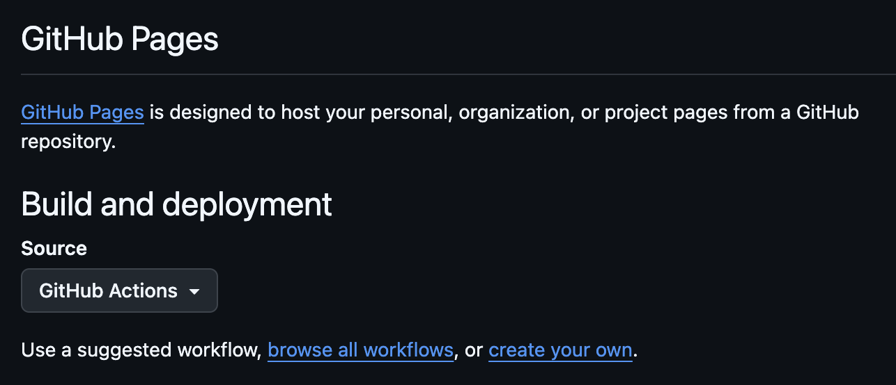
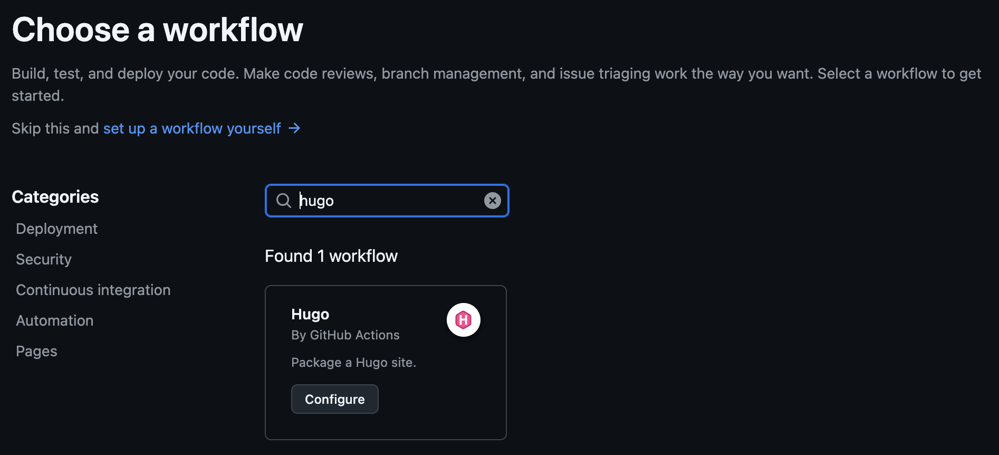

## Info
All of this was done on a MacBookPro 2019, so intel, with hugo installed via brew.

```shell
$ hugo version
hugo v0.145.0+extended+withdeploy darwin/amd64 BuildDate=2025-02-26T15:41:25Z VendorInfo=brew
```

## Basic installation
This log is built using [hugo](https://gohugo.io/), a static website builder written in go. It is easily estesible and there are a lot of ready made templates to get you started, a collection of them can be found [here](https://themes.gohugo.io/). Themes are easily installed as git submodules. I will ot go over the details, they will frequently update and can best be found [here](https://gohugo.io/getting-started/quick-start/)

However, I will note done my commands.

First, I created a public github repository, with pre added GPLv3 License. I then cloned it to my machine. After that, I initialized the hugo website into the existing folder with:
```shell
hugo new site personal-website --force --format yaml
```
The `--force` is needed because the directory was not empty, and the `--format yaml` is recommedned by the template i will be using.
## Theming
Installing the basic theme is as easy as navigating into the hugo website directory and cloning the specific submodule. In this case i used [PaperMod](https://github.com/adityatelange/hugo-PaperMod).
```shell
cd personal-website
git submodule add --depth=1 https://github.com/adityatelange/hugo-PaperMod.git themes/PaperMod
```
### Website Templating
Hugo supports different templates, for different kind of posts. For now, I only have the template [`posts.md`](https://github.com/TheElk205/personal-website/blob/main/archetypes/posts.md?plain=1) in the `archetypes`. However, I will probably extend them in the future, depending on the content i publish.
These templates however, are not displaying templates, but rather content tempaltes. They define the relevant meta data for the post as well as some configuration on what should be shown and what should not be shown. THe actual rendering templates come from the theme and are stored in the cloned submodule. However, if we want to change how our content is displayed, this is failry easy in hugo as well.

### Overwriting templates
I will show this using an example:

The first thing I always look at in blogs or StackOverflow or similar is the date the post hast been written and also edited. This is especially important when looking for how to do something for frontend development, as I have the feeling that this changes every week...

So the base template has a created date, but no automated update date. And as I will forget to manually edit this, I want to use the current date from git, as I am tracking all changes anyway. Fortunately, this is pretty easy: we just have to enable it in the hugo configuration [`hugo.yaml`](https://github.com/TheElk205/personal-website/blob/main/hugo.yaml)
```yaml
enableGitInfo: true

frontmatter:
  lastmod:
  - lastmod
  - :git
  - date
  - publishDate
```

Now we jsut need to edit the rendering template of the html. After some digging, which is basically searching in the project for the usage of `.Date` which is the accessing of the meta data of the post, I found the template file of the theme I am using to be located at `themes/PaperMod/layouts/partials/post_meta.html`. In hugo, in order to overwrite this, the easiest way is to recreate the folder structure in the main driectory of the project. Hugo will look there first and use that file, instead of the one in the theme provided. So Icreated [`layouts/partials/post_meta.html`](https://github.com/TheElk205/personal-website/blob/main/layouts/partials/post_meta.html) with the same content as the original from the theme. Then, after the creation timestamp, i added: 
```go
{{- if not .Lastmod.IsZero -}}
{{- $scratch.Add "meta" (slice (printf "<span title='%s'>updated %s</span>" (.Lastmod) (.Lastmod | time.Format (default "January 2, 2006" site.Params.DateFormat)))) }}
{{- end }}
```

And voila, we have an edited date next to the created date!

Now everything is set up to write our first post, actually this one.

## Adding posts
Adding a post can either be done by hand, by simply creating a file in the appropriate folder, in this case the `content/posts` directory, but then we would use our new template. So we call
```shell
hugo new content posts/website-structure/index.md
```

This will create a new and empty blog post, in its own directory with some placeholders already filled. However, we can easily edit them according to our needs.

## Deployment
As I am hosting the code on github, it was obvius for me to also host the hugo page there for now. We will do this using github pages.

First, we need to enable github pages for the project. For this got to `Settings --> Pages`. Set the source to `Actions`. 
{{ $image := .Resources.Get "action_as_page_source.png" }}

You can then click on `browse all workflows` and simply search for `hugo`. For me, there was only one entry which was the official hugo builder from the github team.

Then click on `Configure` and simply commit the file to the main branch.

Thats it! every time you push now to the main branch, the webiste gets automatically built. You can then reach it via `https://{github-user}.github.io/{project-name}`, so in this case [https://theelk205.github.io/personal-website/](https://theelk205.github.io/personal-website/)